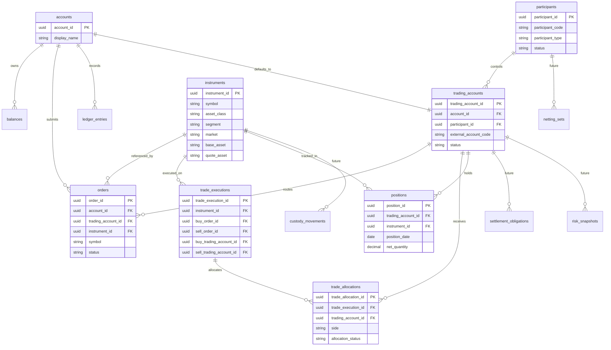
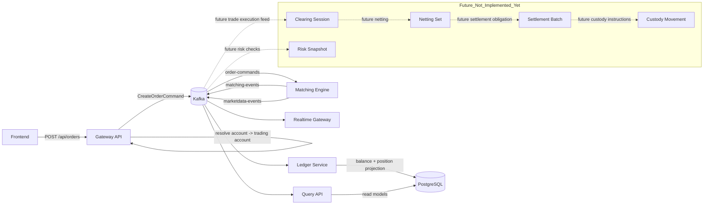

# Exchange Platform Diagrams

## B3-Inspired ER Diagram

```mermaid
erDiagram
    accounts ||--o{ balances : owns
    accounts ||--o{ orders : submits
    accounts ||--o{ ledger_entries : records
    participants ||--o{ trading_accounts : controls
    accounts ||--|| trading_accounts : defaults_to
    instruments ||--o{ orders : referenced_by
    instruments ||--o{ trade_executions : executed_on
    trading_accounts ||--o{ orders : routes
    trading_accounts ||--o{ trade_allocations : receives
    trade_executions ||--o{ trade_allocations : allocates
    trading_accounts ||--o{ positions : holds
    instruments ||--o{ positions : tracked_in
    trading_accounts ||--o{ settlement_obligations : future
    trading_accounts ||--o{ risk_snapshots : future
    participants ||--o{ netting_sets : future
    instruments ||--o{ custody_movements : future

    accounts {
      uuid account_id PK
      string display_name
    }
    trading_accounts {
      uuid trading_account_id PK
      uuid account_id FK
      uuid participant_id FK
      string external_account_code
      string status
    }
    participants {
      uuid participant_id PK
      string participant_code
      string participant_type
      string status
    }
    instruments {
      uuid instrument_id PK
      string symbol
      string asset_class
      string segment
      string market
      string base_asset
      string quote_asset
    }
    orders {
      uuid order_id PK
      uuid account_id FK
      uuid trading_account_id FK
      uuid instrument_id FK
      string symbol
      string status
    }
    trade_executions {
      uuid trade_execution_id PK
      uuid instrument_id FK
      uuid buy_order_id FK
      uuid sell_order_id FK
      uuid buy_trading_account_id FK
      uuid sell_trading_account_id FK
    }
    trade_allocations {
      uuid trade_allocation_id PK
      uuid trade_execution_id FK
      uuid trading_account_id FK
      string side
      string allocation_status
    }
    positions {
      uuid position_id PK
      uuid trading_account_id FK
      uuid instrument_id FK
      date position_date
      decimal net_quantity
    }
```

## Implemented Flow vs Future Target

```mermaid
flowchart LR
    FE[Frontend]
    GW[Gateway API]
    KF[(Kafka)]
    ME[Matching Engine]
    LS[Ledger Service]
    QA[Query API]
    RT[Realtime Gateway]
    PG[(PostgreSQL)]

    FE -->|POST /api/orders| GW
    GW -->|resolve symbol -> instrument| GW
    GW -->|resolve account -> trading account| GW
    GW -->|CreateOrderCommand| KF
    KF -->|order-commands| ME
    ME -->|matching-events| KF
    ME -->|marketdata-events| KF
    KF --> LS
    KF --> QA
    KF --> RT
    LS -->|balance + position projection| PG
    QA -->|read models| PG

    subgraph Future_Not_Implemented_Yet
        CL[Clearing Session]
        NT[Netting Set]
        ST[Settlement Batch]
        RS[Risk Snapshot]
        CM[Custody Movement]
    end

    KF -. future trade execution feed .-> CL
    CL -. future netting .-> NT
    NT -. future settlement obligation .-> ST
    KF -. future risk checks .-> RS
    ST -. future custody instructions .-> CM
```
