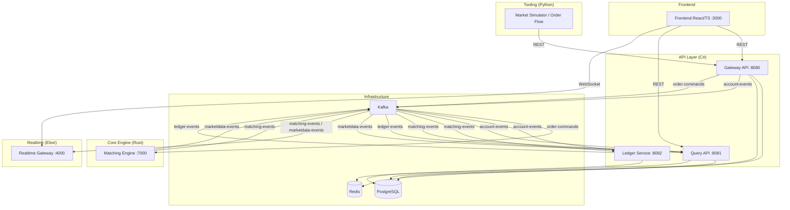
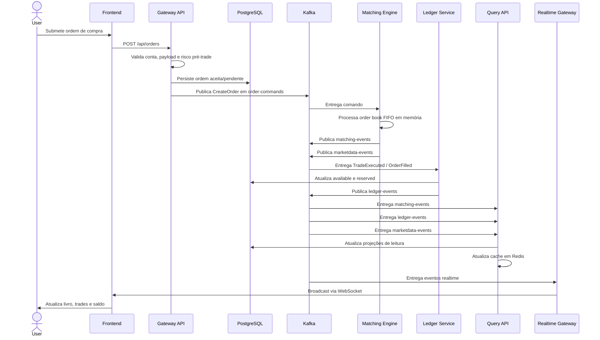
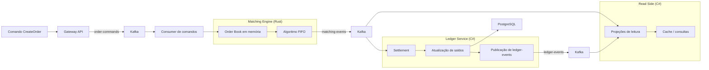
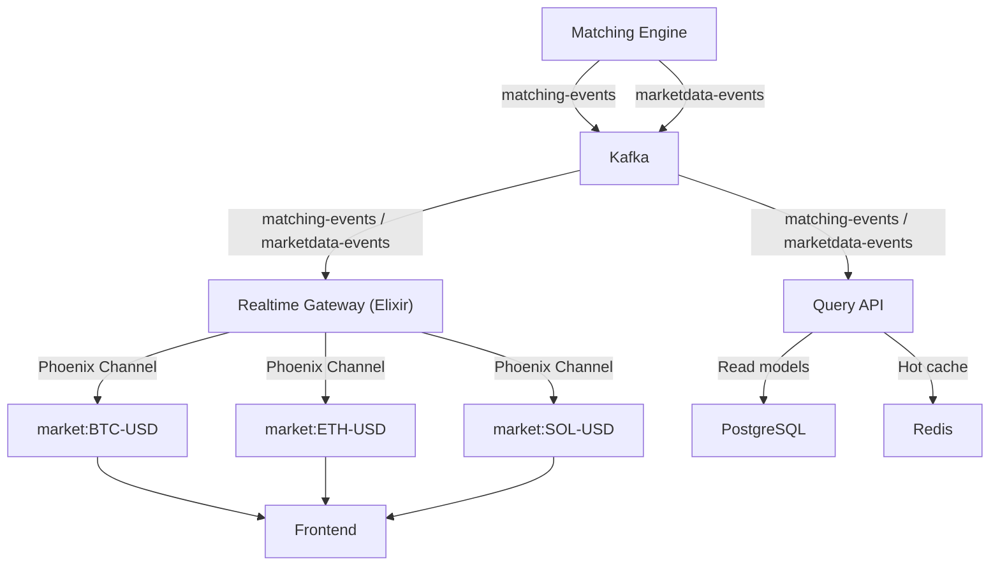
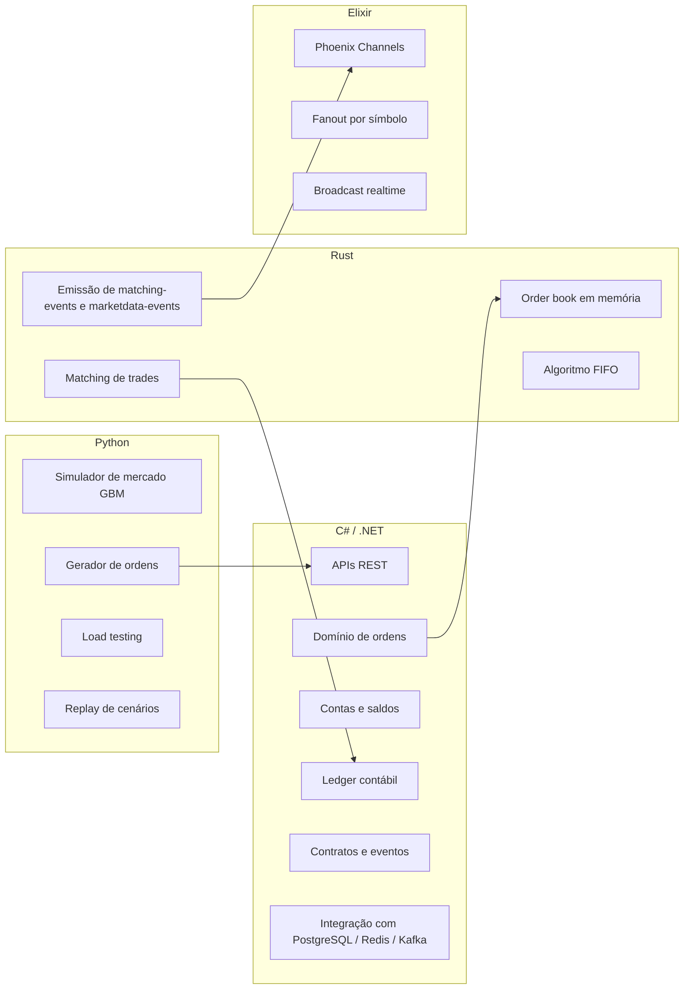

# Exchange Platform - Diagramas de Arquitetura

Este documento contém diagramas Mermaid representando os principais aspectos da plataforma.

---

## 1. Visão Geral dos Serviços

---

## 2. Fluxo de Criação de Ordem

---

## 3. Fluxo de Matching e Ledger

---

## 4. Fluxo de Market Data e Realtime

---

## 5. Separação por Linguagem e Responsabilidade

